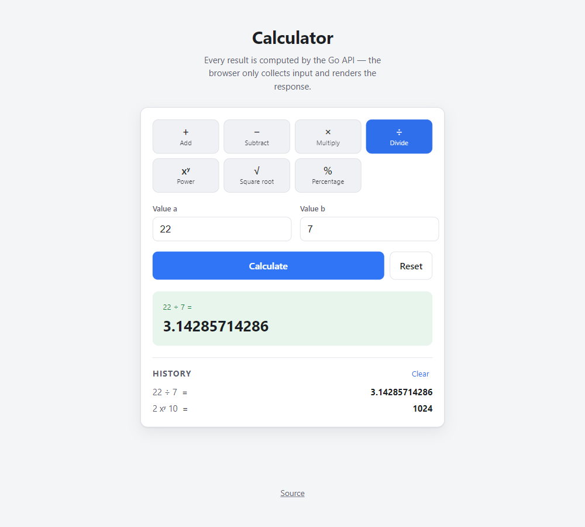

# Full-Stack Calculator

A calculator application split into two independently deployable parts:

| Part                     | Stack                          | Tests                         |
| ------------------------ | ------------------------------ | ----------------------------- |
| [`backend/`](backend/)   | Go 1.23, standard library only | 27 test funcs · ~89 % (calc pkg 100 %) |
| [`frontend/`](frontend/) | React 19 + TypeScript + Vite   | 68 tests · 100 % statements    |

The frontend is a keypad calculator with a live display and keyboard support,
but **all arithmetic, including edge cases like division by zero, is performed
by the backend REST API.** Chained operations evaluate left to right, like a
basic pocket calculator (no operator precedence or parentheses).

<p align="center">
  
</p>

**Contents:** [Architecture](#architecture) · [Prerequisites](#prerequisites) ·
[Setup & running](#setup--running) · [API reference](#api-reference) ·
[Testing](#testing) · [Docker setup](#docker-setup) ·
[Design decisions](#design-decisions) ·
[Assumptions & limitations](#assumptions--limitations)

---

## Architecture

```
┌─────────────────────┐        JSON over HTTP        ┌──────────────────────────┐
│  React SPA           │  ──────────────────────────▶ │  Go calculator service    │
│  (Vite dev server /  │   POST /api/v1/{operation}   │                          │
│   nginx static)      │  ◀────────────────────────── │  internal/calc  (pure)   │
│                      │   { result } | { error }     │  internal/httpapi (REST) │
└─────────────────────┘                              └──────────────────────────┘
```

- **`backend/internal/calc`**, arithmetic as pure `func(float64…) (float64, error)`
  with sentinel domain errors. No HTTP awareness; 100 % test coverage.
- **`backend/internal/httpapi`**, validates requests, maps domain errors to
  HTTP status codes (`400` = unparseable, `422` = semantically invalid), returns
  one consistent JSON envelope.
- **`frontend/src`**, layered `domain → api → hooks → components`. A pure
  `calculatorMachine` reducer owns all keypad/keyboard logic (no arithmetic,
  no I/O); `useCalculator` runs its emitted requests against the API.

Deeper rationale lives in [`backend/README.md`](backend/README.md#design-decisions),
[`frontend/README.md`](frontend/README.md#design-decisions), and the
[OpenAPI 3.1 spec](backend/api/openapi.yaml).

---

## Prerequisites

You need **either** Docker **or** the two language toolchains:

| To run… | Install |
| ------- | ------- |
| The whole stack in containers | Docker Engine 24+ with the Compose plugin (`docker compose`) |
| The backend from source | [Go](https://go.dev/dl/) **1.23 or newer** (`go version`) |
| The frontend from source | [Node.js](https://nodejs.org/) **20 or newer** + npm (`node --version`) |

No databases, message brokers, or other services are required. The backend has
**zero third-party Go dependencies**.

---

## Setup & running

### Option A: Docker (whole stack, one command)

```bash
git clone https://github.com/TunahanIbis/calculator-fullstack.git
cd calculator-fullstack

docker compose up --build
```

Open **http://localhost:8080**. nginx serves the built SPA and reverse-proxies
`/api` to the Go service, so only that one port is published. Stop with
`Ctrl+C`, then `docker compose down` to remove the containers.

### Option B: run each part from source

Two terminals from the repo root.

**1. Backend** (`http://localhost:8080`)

```bash
cd backend
go run ./cmd/server
# {"time":"…","level":"INFO","msg":"calculator service listening","addr":":8080"}
```

The process blocks and logs one line per request. `Ctrl+C` triggers a graceful
shutdown. Verify it independently:

```bash
curl -s localhost:8080/healthz
# {"status":"ok"}
```

**2. Frontend** (`http://localhost:5173`)

```bash
cd frontend
npm install          # first run only
npm run dev
```

Open **http://localhost:5173**. The Vite dev server proxies every `/api/*`
request to `http://localhost:8080`, so the backend must be running too. Hot
reload is on.

### Configuration

Both parts run with zero configuration. To override, use environment variables
(full list in [`backend/.env.example`](backend/.env.example) and
[`frontend/.env.example`](frontend/.env.example)):

| Variable | Side | Default | Purpose |
| -------- | ---- | ------- | ------- |
| `PORT` | backend | `8080` | Listen port |
| `CORS_ALLOWED_ORIGINS` | backend | `http://localhost:5173` | Browser origins allowed to call the API directly (`*` = any) |
| `LOG_LEVEL` | backend | `info` | `debug` \| `info` \| `warn` \| `error` |
| `VITE_API_BASE_URL` | frontend | _(empty)_ | Absolute API origin; empty means same-origin `/api` (dev proxy / nginx) |

---

## API reference

- Base URL: `http://localhost:8080`
- Every operation is `POST` with a JSON body; the response is JSON.
- Binary operations take `{ "a": <number>, "b": <number> }`; `sqrt` (unary)
  takes `{ "a": <number> }`.
- Machine-readable contract: [`backend/api/openapi.yaml`](backend/api/openapi.yaml).
  Live catalogue: `GET /api/v1/operations`.

### Endpoints

| Method & path | Body | Meaning |
| ------------- | ---- | ------- |
| `POST /api/v1/add` | `{a, b}` | `a + b` |
| `POST /api/v1/subtract` | `{a, b}` | `a - b` |
| `POST /api/v1/multiply` | `{a, b}` | `a * b` |
| `POST /api/v1/divide` | `{a, b}` | `a / b` (rejects `b = 0`) |
| `POST /api/v1/power` | `{a, b}` | `a ^ b` |
| `POST /api/v1/sqrt` | `{a}` | `√a` (rejects `a < 0`) |
| `POST /api/v1/percentage` | `{a, b}` | `a` percent of `b` = `(a / 100) * b` |
| `GET /healthz` | n/a | Liveness → `{"status":"ok"}` |
| `GET /api/v1/operations` | n/a | Self-describing list of the above |

### Successful calls

```bash
# Addition
curl -s -X POST localhost:8080/api/v1/add -d '{"a": 2, "b": 3}'
# {"operation":"add","a":2,"b":3,"result":5}

# Subtraction (negative result)
curl -s -X POST localhost:8080/api/v1/subtract -d '{"a": 4, "b": 10}'
# {"operation":"subtract","a":4,"b":10,"result":-6}

# Multiplication
curl -s -X POST localhost:8080/api/v1/multiply -d '{"a": 6, "b": 7}'
# {"operation":"multiply","a":6,"b":7,"result":42}

# Division (repeating decimal, IEEE-754 float64)
curl -s -X POST localhost:8080/api/v1/divide -d '{"a": 22, "b": 7}'
# {"operation":"divide","a":22,"b":7,"result":3.142857142857143}

# Exponentiation
curl -s -X POST localhost:8080/api/v1/power -d '{"a": 2, "b": 10}'
# {"operation":"power","a":2,"b":10,"result":1024}

# Square root (unary, send only "a")
curl -s -X POST localhost:8080/api/v1/sqrt -d '{"a": 144}'
# {"operation":"sqrt","a":144,"result":12}

# Percentage, "15% of 200"
curl -s -X POST localhost:8080/api/v1/percentage -d '{"a": 15, "b": 200}'
# {"operation":"percentage","a":15,"b":200,"result":30}
```

### Error responses

Every non-2xx response is `{ "error": { "code", "message" } }`. `code` is stable
and meant for branching; `message` is human-readable.

```bash
# Division by zero → 422
curl -s -X POST localhost:8080/api/v1/divide -d '{"a": 1, "b": 0}'
# {"error":{"code":"DIVISION_BY_ZERO","message":"division by zero is undefined"}}

# Square root of a negative → 422
curl -s -X POST localhost:8080/api/v1/sqrt -d '{"a": -4}'
# {"error":{"code":"NEGATIVE_SQRT","message":"square root of a negative number is not a real number"}}

# Overflow / non-finite result → 422
curl -s -X POST localhost:8080/api/v1/power -d '{"a": 10, "b": 400}'
# {"error":{"code":"NON_FINITE_NUMBER","message":"result is not a finite number (overflow or undefined)"}}

# Missing operand → 422
curl -s -X POST localhost:8080/api/v1/add -d '{"a": 1}'
# {"error":{"code":"VALIDATION_ERROR","message":"missing required numeric field(s): b"}}

# Malformed / unknown-field / wrong-type body → 400
curl -s -X POST localhost:8080/api/v1/add -d '{"a": 1, "b": 2, "c": 3}'
# {"error":{"code":"INVALID_JSON","message":"request body contains unsupported field \"c\""}}

# Unknown route → 404 · wrong method on a known route → 405 (+ Allow header)
curl -s localhost:8080/api/v1/nope
# {"error":{"code":"NOT_FOUND","message":"no such endpoint"}}
```

| HTTP | `code` | When |
| ---- | ------ | ---- |
| 400 | `INVALID_JSON` | Body missing, malformed, wrong types, unknown fields, or trailing data |
| 404 | `NOT_FOUND` | Unknown route |
| 405 | `METHOD_NOT_ALLOWED` | Known route, wrong method (`Allow` header included) |
| 422 | `VALIDATION_ERROR` | Valid JSON, but a required operand is missing / an extra one supplied |
| 422 | `DIVISION_BY_ZERO` | `divide` with `b = 0` |
| 422 | `NEGATIVE_SQRT` | `sqrt` with `a < 0` |
| 422 | `NON_FINITE_NUMBER` | Operand is `NaN`/`±Inf`, or the result overflows |
| 500 | `INTERNAL_ERROR` | Unexpected server error (also from the panic-recovery middleware) |

---

## Testing

```bash
# Backend, unit + httptest integration, race detector, coverage
cd backend
go test -race ./...
go test ./... -covermode=count -coverprofile=coverage.out
go tool cover -func=coverage.out            # ~89 % total, calc pkg 100 %
go tool cover -html=coverage.out            # line-by-line report

# Frontend, Vitest + React Testing Library
cd frontend
npm test                                     # 67 tests
npm run coverage                             # 100 % statements / functions / lines
```

CI ([`.github/workflows/ci.yml`](.github/workflows/ci.yml)) runs on every push
and PR: `gofmt` / `go vet` / race tests + coverage for the backend;
`eslint` / `tsc` / Vitest coverage / production build for the frontend; both
Docker images; and a smoke test that the composed stack answers
`{"a":2,"b":3}` → `{"result":5}`. Coverage reports are uploaded as artifacts.

---

## Docker setup

```
                       ┌───────────────── calculator-web (nginx-unprivileged) ──┐
  host :8080  ────────▶│  /            → dist/index.html  (SPA fallback)          │
                       │  /assets/*    → immutable-cached static bundle           │
                       │  /api/*       → proxy_pass ─────────────┐                │
                       └────────────────────────────────────────┼────────────────┘
                                                                ▼
                       ┌──────────── calculator-service (distroless) ────────────┐
                       │  Go binary, non-root, :8080, HEALTHCHECK "/server        │
                       │  healthcheck" (self-probes GET /healthz, no shell)      │
                       └─────────────────────────────────────────────────────────┘
```

| File | Role |
| ---- | ---- |
| [`backend/Dockerfile`](backend/Dockerfile) | Multi-stage: `golang:1.23-alpine` build → static `CGO_ENABLED=0` binary → `gcr.io/distroless/static` (non-root, no shell). Optional `--target test` stage runs `go vet` + `go test`. |
| [`frontend/Dockerfile`](frontend/Dockerfile) | Multi-stage: `node:22-alpine` → `npm ci` + `vite build` → `nginxinc/nginx-unprivileged` serving `dist/`. |
| [`frontend/nginx.conf`](frontend/nginx.conf) | Serves the SPA, hard-caches `/assets/*`, `try_files … /index.html` fallback, reverse-proxies `/api/` to `backend:8080` (resolved per-request via Docker DNS). |
| [`docker-compose.yml`](docker-compose.yml) | Wires the two on one network; `frontend` waits for `backend` to be `service_healthy`; only `8080` is published. |

Verified end to end with `docker compose up --build` (Docker 29, Compose 2.40):
both services reach `healthy` in ~6 s; `GET /`, the SPA fallback, a missing
asset (→ 404), and `add` / `divide`-by-zero (→ 422) / `power` / `sqrt` / bad
JSON (→ 400) all behave correctly through the composed nginx→backend path.
Image sizes: **backend 14.8 MB** (distroless), **frontend 74 MB** (nginx-alpine).

---

## Design decisions

**The browser never does arithmetic.** Client-side validation is deliberately
narrow, "is this a finite number?", so there is exactly one place, the Go
service, where a rule like `2 / 0` is decided. This keeps the layers honest and
the contract testable from both ends.

**Backend: standard library only.** Go 1.22's `net/http.ServeMux` does
method + path patterns (`POST /api/v1/add`), so a third-party router/framework
buys nothing here. Zero dependencies → a trivial `go.mod` (no `go.sum`), nothing
to audit, and a `scratch`-sized container.

**Pure domain core.** `internal/calc` takes `float64` and returns
`(float64, error)` with sentinel errors (`ErrDivideByZero`, …). The HTTP layer
maps those to status codes with `errors.Is`. The math is unit-testable in
isolation and reusable from a CLI or queue consumer unchanged.

**One operations table, one handler factory.** A single `operations` slice
drives routing, the `/api/v1/operations` discovery endpoint, and the
404-vs-405 fallback. The frontend mirrors it in `domain/operations.ts`. Adding
an operation is one row on each side plus one function in `calc`.

**`400` vs `422`.** `400 INVALID_JSON` means "I can't parse this request".
`422` means "I parsed it, but it doesn't make sense", a well-formed body with a
missing operand, division by zero, a negative square root, or an overflowing
result. Malformed bodies are rejected strictly: 1 KiB size cap, unknown fields
refused, no trailing data, operands are `*float64` so a missing field differs
from an explicit `0`.

**Result sanity check.** Any operation whose result is `±Inf`/`NaN` (overflow,
`0 ^ -1`, …) returns `NON_FINITE_NUMBER` instead of emitting invalid JSON or a
misleading number.

**Frontend layering.** `domain/` (a pure `calculatorMachine` reducer + a number
formatter) → `api/` (a `fetch` wrapper that normalises every failure to a typed
`ApiError` with a stable `code`) → `hooks/useCalculator` (runs the machine's
emitted requests against the API, logs history, buffers keystrokes typed
mid-request) → `components/` (Display, Keypad, HistoryList, Calculator). The
machine does no arithmetic and no I/O, so every keypad/keyboard interaction is
covered by fast DOM-free tests. Errors stay typed internally and become
sentences only at render time.

**Operational niceties.** Structured JSON logging (`log/slog`), one log line per
request with status + latency, panic-recovery middleware, scoped CORS, HTTP
read/write timeouts, signal-driven graceful shutdown, and a self-probing
container healthcheck so the shell-less distroless image stays health-aware.

**Keyboard-first & accessible.** Keypad keys are real `<button>`s with
`aria-label`s, the display is an `aria-live` `output`, and a global `keydown`
handler maps the physical keyboard (`0-9 . , + - * / ^ %`, Enter, Backspace,
Esc) to the same actions; both paths are tested. No component library, ~330
lines of hand-written CSS with a `prefers-color-scheme` dark theme (~64 kB
gzipped JS).

---

## Assumptions & limitations

- **Numeric model:** all arithmetic is IEEE-754 `float64`. Very large magnitudes
  and repeating decimals carry the usual floating-point imprecision; the
  frontend trims display noise (`0.1 + 0.2` → `0.3`) but the API returns the
  raw value. Arbitrary-precision math was out of scope.
- **`percentage(a, b)` is defined as `(a / 100) * b`** ("a percent of b"), e.g.
  `percentage(15, 200) = 30`. On the keypad it is a binary operator: `15 % 200 =`.
- **`power` accepts any real exponent**; results that overflow `float64` or are
  undefined (e.g. `0 ^ -1`, `(-1) ^ 0.5`) return `NON_FINITE_NUMBER` rather than
  an error specific to the operation.
- **Stateless service.** No persistence, no accounts, no rate limiting, no
  auth. Calculation history lives in the browser tab only and is lost on
  refresh.
- **No expression parsing, no precedence.** There is no `"2 + 3 * 4"` endpoint;
  each operation is its own explicit route with two (or one) operands. The
  keypad chains steps **left to right like a pocket calculator**, so
  `2 + 3 × 4 =` is `20`. A precedence/parenthesis evaluator was deliberately
  left out (the brief asks to prioritise correctness over extra features).
- **Deployment shape:** the intended production topology is single-origin:
  nginx serves the SPA and proxies `/api` to the backend on the same host, so
  CORS is really only needed for local development (Vite on `:5173` calling the
  API on `:8080`).
- **API versioning** is via the `/api/v1` path prefix; there is no content
  negotiation or header-based versioning.

---

## Repository layout

```
.
├── backend/            Go microservice (REST API)
│   ├── api/openapi.yaml
│   ├── cmd/server/                 entrypoint (also `server healthcheck`)
│   └── internal/{app,calc,config,httpapi}/
├── frontend/           React + TypeScript client
│   └── src/{domain,api,hooks,components}/
├── docker-compose.yml  full stack behind one nginx port
├── .github/workflows/  CI pipeline
├── docs/screenshot.png
└── README.md
```

## License

[MIT](LICENSE)
